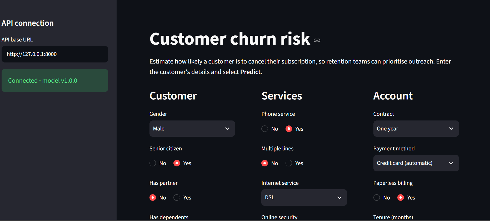
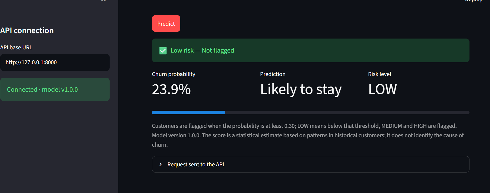
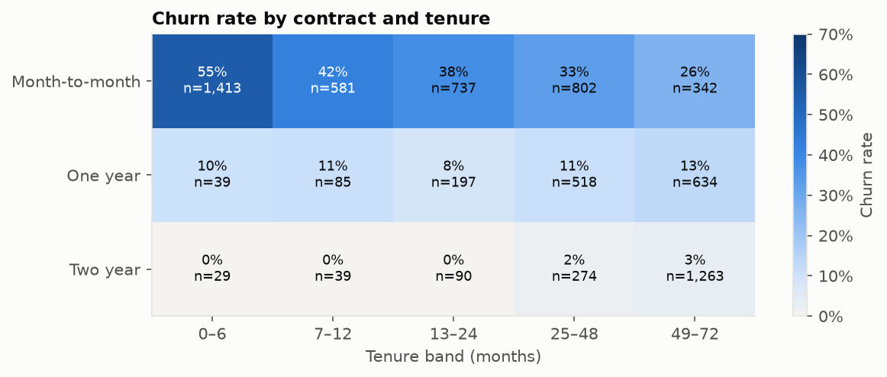
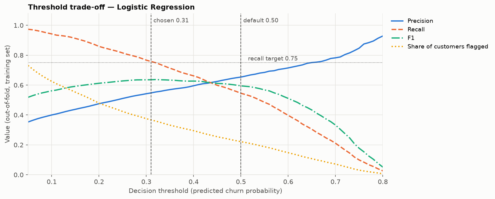
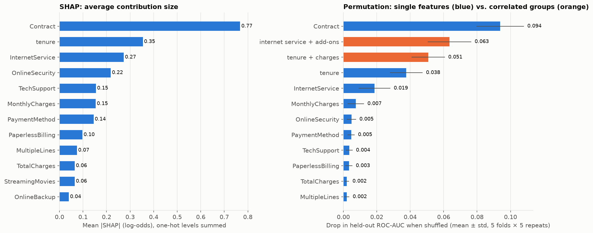

# Customer Churn Prediction System

An end-to-end machine learning system that estimates how likely a telecom customer is to cancel, turns that into a retention decision, explains which factors drive each prediction, and serves predictions through a **FastAPI** backend and a **Streamlit** frontend.

Built incrementally in 14 phases, with every modelling decision made on training data and cross-validation, and a held-out test set protected from tuning.

## Project Preview

### Dashboard



### Prediction Result



---

## Contents

1. [Business problem](#business-problem)
2. [Key capabilities](#key-capabilities)
3. [Architecture and data flow](#architecture-and-data-flow)
4. [Project structure](#project-structure)
5. [Dataset and validation](#dataset-and-validation)
6. [Exploratory data analysis](#exploratory-data-analysis)
7. [Preprocessing and feature handling](#preprocessing-and-feature-handling)
8. [Baseline model comparison](#baseline-model-comparison)
9. [Threshold selection and the held-out test set](#threshold-selection-and-the-held-out-test-set)
10. [Tuning and final model selection](#tuning-and-final-model-selection)
11. [Evaluation status: what was measured where](#evaluation-status-what-was-measured-where)
12. [Explainability](#explainability)
13. [Production artifact and inference](#production-artifact-and-inference)
14. [FastAPI backend](#fastapi-backend)
15. [Streamlit frontend](#streamlit-frontend)
16. [Testing and validation](#testing-and-validation)
17. [Setup and run instructions](#setup-and-run-instructions)
18. [Deployment](#deployment)
19. [Known limitations](#known-limitations)
20. [Future improvements](#future-improvements)
21. [Interview talking points](#interview-talking-points)

---

## Business problem

Subscription businesses lose revenue when customers cancel ("churn"). Retaining a customer is usually cheaper than acquiring a new one, but retention offers (discounts, calls) cost money, so they should go to the customers most likely to leave.

This system answers: **"How likely is this customer to churn, should we act, and why?"**

- Output is a **probability**, not just a yes/no, so the business can rank customers and choose how many to contact.
- A **decision threshold** turns the probability into a flag; **risk bands** (LOW / MEDIUM / HIGH) make it readable for non-technical users.
- **Explanations** show which customer attributes pushed a prediction up or down (as associations, not causes).

## Key capabilities

- Reproducible data acquisition with checksum verification, and schema validation that fails loudly.
- One scikit-learn `Pipeline` (preprocessing + model) used for training, evaluation, and serving — preprocessing is never re-implemented.
- Model selection with repeated stratified cross-validation and paired comparisons; a held-out test set that never influenced tuning.
- Explicit, reproducible decision-threshold rule based on a business assumption.
- SHAP and grouped permutation importance, with correlated features handled explicitly.
- Versioned model artifact with metadata and an integrity checksum.
- FastAPI service with strict request validation; Streamlit UI that only talks to the API.
- 214 automated tests, including end-to-end integration tests and a live smoke test.

## Architecture and data flow

```
                      TRAINING (offline)                                     SERVING (online)

 IBM Telco CSV ──► churn.data ──► train split (80%) ──► churn.train          Streamlit UI (app/)
 (SHA-256 checked)  load/clean/     stratified,           fit locked               │  HTTP POST /predict
                    validate        seed 42               Pipeline                 ▼
                                    │                        │               FastAPI (api/)
                                    └─ test split (20%)      ▼               Pydantic validation
                                       held out         models/                    │
                                                        churn_pipeline_v1.0.0.joblib  ◄── churn.predict
                                                        churn_pipeline_v1.0.0.json        load_model() → validate_customer()
                                                                                          → Pipeline.predict_proba()
                                                                                          → threshold + risk band
```


**Serving path:** Streamlit → FastAPI → `churn.predict` → saved Pipeline artifact.

- The saved `Pipeline` contains the fitted `ColumnTransformer` (scaling/one-hot encoding) **and** the model. At inference, raw customer fields go into that same object, so training and serving preprocessing are identical by construction.
- The API never imports scikit-learn, joblib, or training code; the UI never imports the model or the inference module. Both rules are enforced by tests.

## Project structure

```
├── src/churn/                  # installable package (pip install -e .)
│   ├── config.py               # paths, seed, model version
│   ├── data.py                 # download (checksum), load, clean, validate, split
│   ├── preprocessing.py        # feature groups, ColumnTransformer, Pipeline builder
│   ├── evaluation.py           # metrics, threshold tables, threshold rule, bootstrap CIs
│   ├── modeling.py             # baseline models, repeated stratified CV
│   ├── tuning.py               # search spaces, hyperparameter search
│   ├── explain.py              # SHAP, one-hot → feature mapping, grouped permutation importance
│   ├── train.py                # production training → versioned artifact (python -m churn.train)
│   └── predict.py              # load artifact, validate input, predict (serving only)
├── api/                        # FastAPI app (main.py, schemas.py)
├── app/                        # Streamlit UI (streamlit_app.py, api_client.py, inputs.py)
├── notebooks/                  # 01_eda … 06_explainability (analysis; import from src/)
├── reports/                    # CV/test results (CSV/JSON), locked decisions, figures/
├── models/                     # build outputs of `python -m churn.train` (git-ignored)
├── scripts/e2e_smoke.py        # live Streamlit → FastAPI → artifact smoke test
├── tests/                      # 214 pytest tests
├── data/raw/, data/processed/  # git-ignored; dataset is downloaded, not committed
├── render.yaml                 # API deployment blueprint (Render, free tier)
├── docs/portfolio_summary.md   # one-page project summary
├── pyproject.toml, requirements.txt
```

| Notebook | Purpose |
|---|---|
| `01_eda.ipynb` | Churn patterns, distributions, redundancy, leakage checks |
| `02_preprocessing.ipynb` | Split, encoded features, `TotalCharges` experiment |
| `03_model_comparison.ipynb` | Baseline CV comparison |
| `04_threshold_and_test_evaluation.ipynb` | Threshold rule, single held-out test evaluation (baseline) |
| `05_model_tuning.ipynb` | Hyperparameter search and final model selection (CV only) |
| `06_explainability.ipynb` | SHAP and permutation importance for the final model |

## Dataset and validation

**IBM Telco Customer Churn** sample data: 7,043 customers of a fictional telecom company, 21 columns (`customerID`, 19 attributes, target `Churn`).

- **Source:** [IBM/telco-customer-churn-on-icp4d](https://github.com/IBM/telco-customer-churn-on-icp4d) (`data/Telco-Customer-Churn.csv`). The repository is Apache-2.0 licensed; that licence does not explicitly address the data file, and no separate IBM data terms were found. Also mirrored on [Kaggle](https://www.kaggle.com/datasets/blastchar/telco-customer-churn).
- **Not committed.** `python -m churn.data` downloads it and verifies SHA-256 `16320c9c…055e91`, so every clone uses the identical file.

**Validation** (`churn.data.validate_data`) collects every problem and raises one error: required columns, no missing values, unique IDs, allowed category values, non-negative numbers, binary target, and two consistency rules (`InternetService == "No"` ⇔ all six add-ons are `"No internet service"`; `PhoneService == "No"` ⇔ `MultipleLines == "No phone service"`).

**Data-quality findings**

| Finding | Handling |
|---|---|
| `TotalCharges` stored as text; 11 values are a single space — all for customers with `tenure == 0` | Set to `0.0` (not yet billed). Any other unparseable value raises an error. |
| 73 rows (33 groups) identical except `customerID`, all tenure = 1; 18 groups have conflicting labels | Kept: distinct customers on identical plans. Shows the features cannot separate every case. |
| `customerID` is an identifier | Excluded from model features. |
| No duplicate IDs, no other missing values; both consistency rules hold on every row | — |

## Exploratory data analysis

Overall churn is **26.5%** (1,869 of 7,043) — moderately imbalanced, so accuracy is not a useful metric (always predicting "stay" scores 73.5%).

| Pattern | Churn rate |
|---|---|
| Contract: month-to-month / one year / two year | 42.7% / 11.3% / 2.8% |
| Tenure: 0–6 months → 49–72 months | 52.9% → 9.5% |
| Internet: fiber optic / DSL / none | 41.9% / 19.0% / 7.4% |
| Payment: electronic check vs. other methods | 45.3% vs. 15–19% |
| No online security / no tech support (vs. with) | 41.8% / 41.6% (vs. ~15%) |

- Contract is not just a proxy for tenure: month-to-month churns more in every tenure band.
- Fiber churns more than DSL even at the same monthly-charge level, so it is not purely a price effect.
- **Redundancy:** `TotalCharges ≈ tenure × MonthlyCharges` (94.6% within ±10%; Spearman 0.89 with tenure); `PhoneService` is fully determined by `MultipleLines` (Cramér's V = 1.0); internet add-ons overlap strongly (V ≈ 0.71–0.77).
- **Leakage check:** no category level has 0% or 100% churn; no column describes post-churn events.
- Near-zero signal: `gender`, `PhoneService`, `MultipleLines`.



## Preprocessing and feature handling

Defined once in `src/churn/preprocessing.py` and always wrapped in a `Pipeline` with the model:

| Group | Features | Transform |
|---|---|---|
| Numeric (3) | `tenure`, `MonthlyCharges`, `TotalCharges` | `StandardScaler` (Logistic Regression) or passthrough (trees) |
| Binary (5) | `gender`, `SeniorCitizen`, `Partner`, `Dependents`, `PaperlessBilling` | One-hot, one column each |
| Multi-level (10) | `MultipleLines`, `InternetService`, 6 add-ons, `Contract`, `PaymentMethod` | One-hot, all levels |
| Excluded | `customerID`, `PhoneService` | ID has no meaning; `PhoneService` is encoded by `MultipleLines` |

Result: 18 input features → 39 model columns.

- **Categories come from the validated schema**, not from the training data, so output columns are fixed and unknown categories raise an error instead of silently becoming all zeros.
- **No imputer:** validation guarantees no missing values; an imputer would hide upstream problems.
- **Leakage prevention:** the preprocessor is fitted inside each CV fold and on the training split only.
- **`TotalCharges` kept, based on evidence:** with a pre-stated rule (keep only if it improves ROC-AUC or PR-AUC by > 2 standard errors), repeated CV showed a small but consistent gain for Logistic Regression (ROC-AUC +0.0012, ≈4.8 SE, better in 14/15 folds); within noise for trees.
- **No engineered features:** candidates from EDA were either linear combinations of existing columns or patterns tree models learn directly.

## Baseline model comparison

Repeated stratified 5-fold CV × 3 repeats (15 folds) on the **training split only**; every model sees identical folds. Mean ± std; precision/recall/F1 at the default 0.5 threshold.

| Model (untuned) | ROC-AUC | PR-AUC | Recall@0.5 | Brier ↓ | Log loss ↓ | Train ROC-AUC |
|---|---|---|---|---|---|---|
| Logistic Regression | **0.846 ± 0.012** | **0.661 ± 0.018** | 0.545 | **0.135** | **0.417** | 0.850 |
| HistGradientBoosting | 0.837 ± 0.011 | 0.650 ± 0.020 | 0.523 | 0.140 | 0.435 | 0.962 |
| Random Forest | 0.826 ± 0.013 | 0.621 ± 0.029 | 0.498 | 0.144 | 0.467 | 1.000 |

- Logistic Regression beat both tree models in 14–15 of 15 paired folds.
- Default tree ensembles overfit badly (train–validation gap 0.13–0.17).
- At threshold 0.5 every model missed about half of churners — a property of the threshold, addressed next.

## Threshold selection and the held-out test set

**Business framing.** A false negative (missed churner) loses a customer's future revenue; a false positive costs one retention offer. With real costs, the threshold would be `contact cost ÷ (customer value × offer success rate)`. Those numbers are not available, so an explicit, adjustable policy is used instead.

**Rule (stated before seeing results):** *choose the threshold with the highest precision among those with out-of-fold recall ≥ 0.75.* The 0.75 target ("reach three out of four churners") is a **provisional business assumption**.



**Phase 6 — single evaluation on the held-out test set (baseline Logistic Regression, threshold 0.31).** The model and threshold were written to `reports/locked_decisions_baseline.json` *before* the test set was loaded; it was then scored once.

| Metric | Test (n = 1,409, 374 churners) | 95% bootstrap CI | CV mean ± std |
|---|---|---|---|
| ROC-AUC | 0.842 | 0.820–0.862 | 0.846 ± 0.012 |
| PR-AUC | 0.634 | 0.583–0.687 | 0.661 ± 0.018 |
| Recall | 0.749 | 0.704–0.792 | 0.758 ± 0.031 |
| Precision | 0.529 | 0.488–0.570 | 0.548 ± 0.016 |
| F1 | 0.620 | 0.583–0.656 | 0.636 ± 0.014 |
| Brier / log loss | 0.138 / 0.420 | | 0.135 / 0.417 |

Confusion matrix: TN 786, FP 249, FN 94, TP 280 (529 customers flagged; about 1 in 2 flagged customers churned vs. a 26.5% base rate). Compared with threshold 0.5, the chosen threshold caught 71 more churners at the cost of 140 more false alarms. Train, CV, and test agreed closely (ROC-AUC 0.849 / 0.846 / 0.842): no sign of overfitting.

## Tuning and final model selection

Tuning used **training data only**. To limit selection optimism, hyperparameters were searched on one CV split (seed 43) and the winners re-evaluated on the Phase 5 folds (seed 42) for paired comparison.

| Model | Search space |
|---|---|
| Logistic Regression | `C` ∈ {0.001 … 10} (9 values) × L1/L2 — 18 configurations |
| HistGradientBoosting | learning rate, iterations, leaf count, depth, min leaf size, L2 — 25 random draws |
| Random Forest | min leaf size × max features — 15 configurations |

| Model | ROC-AUC (baseline → tuned) | PR-AUC (baseline → tuned) | Train–CV gap |
|---|---|---|---|
| Logistic Regression | 0.846 → 0.846 | 0.661 → 0.660 | 0.003 → 0.004 |
| HistGradientBoosting | 0.837 → **0.850** | 0.650 → **0.669** | 0.126 → 0.016 |
| Random Forest | 0.826 → 0.849 | 0.621 → 0.665 | 0.174 → 0.031 |

**Selection rule (stated in advance):** highest CV ROC-AUC, unless it beats tuned Logistic Regression by less than 2 standard errors (paired), in which case keep the simpler model.
Tuned HistGradientBoosting beat tuned Logistic Regression by ROC-AUC +0.003 (3.2 SE, better in 12/15 folds) and PR-AUC +0.009 (3.7 SE) → **selected**.

Honest assessment: tuning removed the tree models' overfitting, but the gain over the best baseline is **statistically consistent yet practically small** (ROC-AUC 0.846 → 0.850). Tuned Logistic Regression remains a near-equivalent, more interpretable alternative.

### Final locked model (`reports/locked_decisions_tuned.json`)

| Item | Value |
|---|---|
| Model | `HistGradientBoostingClassifier` |
| Hyperparameters | `learning_rate=0.015836308681309343`, `max_iter=300`, `max_leaf_nodes=7`, `max_depth=5`, `min_samples_leaf=200`, `l2_regularization=5.626265699005659`, `random_state=42` |
| Decision threshold | **0.30** (same rule as Phase 6; chosen identically in all 3 CV repeats) |
| Risk bands | **LOW** < 0.30 ≤ **MEDIUM** < 0.60 ≤ **HIGH** |
| CV at threshold 0.30 | ROC-AUC 0.850, PR-AUC 0.669, recall 0.760, precision 0.546, F1 0.635, Brier 0.134 |
| Training data | 5,634 rows (training split only), churn rate 26.54%, dataset SHA-256 `16320c9c1ec72448db59aa0a26a0b95401046bef5d02fd3aeb906448e3055e91` |

Risk bands: LOW means below the action threshold (not flagged). HIGH starts at 0.60, where out-of-fold precision is ≈ 0.71, covering ≈ 14% of training customers. Bands are stored in artifact metadata, not hard-coded in the API.

## Evaluation status: what was measured where

| Result | Data used | Status |
|---|---|---|
| EDA, feature decisions, baseline comparison | Training split / CV | Complete |
| Threshold 0.31 and baseline test metrics above | Held-out test set, **once** (Phase 6) | Complete — the only test-set evaluation so far |
| Tuning, final model choice, threshold 0.30 | Training split / CV only | Complete — test set **not** used |
| Final tuned model on the test set | — | **Not yet evaluated.** Its expected performance is the CV estimate (ROC-AUC 0.850 ± 0.012). |

The held-out test set was used once, for the Phase 6 baseline, and did not influence tuning, model selection, or the final threshold. Evaluating the tuned model on the same test set later would be a **second look** at that data and should be reported as such.

## Explainability

For the final model, fitted on the training split (`notebooks/06_explainability.ipynb`, `src/churn/explain.py`):

- **SHAP (TreeExplainer, exact)** on the pipeline's own preprocessed output; one-hot columns are mapped back to their original feature using the fitted encoder and summed. Values are in **log-odds**; base value −1.504 (18.2%). Contributions add up in log-odds, not in percentage points.
- **Grouped permutation importance** (drop in held-out ROC-AUC, 5-fold CV) for single features and for correlated groups shuffled together.

| Feature / group | Mean \|SHAP\| | ROC-AUC drop when shuffled |
|---|---|---|
| Contract | 0.77 | 0.094 |
| Internet service + 6 add-ons (group) | 0.51 | 0.063 |
| Tenure + monthly + total charges (group) | 0.40 | 0.051 |
| tenure alone | 0.35 | 0.038 |
| InternetService alone | 0.27 | 0.019 |

- Month-to-month raises predicted risk on average (+0.79 log-odds); two-year contracts lower it (−1.05). Risk contribution falls steadily with tenure; monthly charges above ≈ $80 push risk up. Fiber optic (+0.28), no online security (+0.21), electronic check (+0.19), and no tech support (+0.15) raise risk.
- **Correlated features share credit:** each group matters far more than any member alone, because the model can fall back on correlated partners. Group-level statements are more reliable than individual feature rankings within a group.
- `gender`, `Partner` (never used), `DeviceProtection`, `Dependents`, and `SeniorCitizen` contribute little. `SeniorCitizen` was associated with churn in EDA, but adds little once contract, charges, and services are known.
- These are associations learned by the model, **not causes** of churn.



## Production artifact and inference

`python -m churn.train` fits the locked configuration (read from `reports/locked_decisions_tuned.json`) on the 5,634 training rows and writes:

| File | Contents |
|---|---|
| `models/churn_pipeline_v1.0.0.joblib` | Fitted `Pipeline` (preprocessing + model), ~300 KB |
| `models/churn_pipeline_v1.0.0.json` | Version, creation time, hyperparameters, threshold, risk bands, input schema, training-data fingerprint, library versions, SHA-256 of the `.joblib` |

**Artifact strategy: build from source, never commit.** Both files are git-ignored build outputs.

- The build is deterministic: from the checksum-verified dataset and the locked decision, retraining reproduced a byte-identical `.joblib` (same SHA-256) and identical predictions (also checked by the integration tests).
- A pickled scikit-learn object is only guaranteed to load with the scikit-learn version that created it; building in the target environment avoids version mismatches. Binary files would also bloat git history.
- Every environment — a fresh clone, CI, or the deployment build — obtains the artifact the same way: `python -m churn.data` then `python -m churn.train` (a few seconds).
- What gets built is fixed by committed files: `reports/locked_decisions_tuned.json` (model, hyperparameters, threshold), `src/` (preprocessing), and the dataset checksum.

**Inference (`churn.predict`)**

1. `load_model()` — checks both files exist, the checksum matches, the version matches, required metadata is present, and the object is a Pipeline; warns if the scikit-learn version differs. Any problem raises `ModelArtifactError`.
2. `validate_customer()` — required/unknown fields, numeric types, whole-month tenure, then the same schema rules as the training data.
3. `predict_customer()` — `Pipeline.predict_proba` → `{churn_probability, prediction, risk_level, threshold, model_version}`.

## FastAPI backend

The model is loaded once at startup (no training). If loading fails, the service still starts and reports the problem via `/health`.

| Endpoint | Description |
|---|---|
| `GET /health` | `{"status": "ok", "model_loaded": true, "model_version": "1.0.0"}`; **503** if the model is not loaded |
| `GET /model` | Version, model, creation time, threshold and rule, risk bands, features, training rows, CV metrics |
| `POST /predict` | One customer → `churn_probability`, `prediction`, `risk_level`, `threshold`, `model_version` |

Validation: all 18 fields required, unknown fields rejected, exact category values (generated from the training schema), strict numbers (no strings, NaN, or booleans; `tenure` and `SeniorCitizen` must be JSON integers). Cross-field rules are enforced by `churn.predict`. Invalid input → **422** with a list of problems (the submitted values are not echoed back). Model unavailable → **503**.

Example request (interactive docs at `/docs`):

```json
{"gender": "Female", "SeniorCitizen": 0, "Partner": "Yes", "Dependents": "No", "tenure": 2,
 "MultipleLines": "No", "InternetService": "Fiber optic", "OnlineSecurity": "No", "OnlineBackup": "No",
 "DeviceProtection": "No", "TechSupport": "No", "StreamingTV": "No", "StreamingMovies": "No",
 "Contract": "Month-to-month", "PaperlessBilling": "Yes", "PaymentMethod": "Electronic check",
 "MonthlyCharges": 70.7, "TotalCharges": 151.65}
```

Response (production model):

```json
{"churn_probability": 0.6535, "prediction": 1, "risk_level": "HIGH", "threshold": 0.3, "model_version": "1.0.0"}
```

## Streamlit frontend

`app/streamlit_app.py` — a single page for retention teams.

- Inputs grouped as **Customer**, **Services**, **Account**. Choosing "no phone service" or "no internet" hides dependent questions and fills the correct values, so inconsistent combinations cannot be submitted. Total charges default to tenure × monthly (editable).
- Result: risk banner with icon and label (not colour alone), churn probability, prediction, risk level, threshold, and model version, with a note that the score is an estimate, not a cause.
- Sidebar: configurable API URL (default `http://127.0.0.1:8000`, or `CHURN_API_URL`) and live connection status.
- Validation errors, an unreachable API, and an unloaded model are shown as messages, never crashes.
- Scoring happens only through `POST /predict`; the UI never loads the model.

## Testing and validation

**214 tests** (`pytest`), covering:

| Area | Examples |
|---|---|
| Data | Cleaning rules, every validation rule, checksum mismatch, missing file |
| Preprocessing | Feature groups, fixed output columns, unknown categories rejected, scaler fitted on training data only |
| Modeling / evaluation / thresholds / tuning | Out-of-fold coverage, reproducibility, metric correctness, threshold rule tie-breaks |
| Explainability | One-hot mapping, SHAP additivity, local explanation matches prediction, permutation importance detects a planted signal |
| Artifact and inference | Save/load, checksum and corrupted-artifact handling, input validation, determinism, risk-band boundaries |
| FastAPI / Streamlit client | Endpoints, 422/503 handling, client error handling, headless Streamlit render |
| Integration (real data + artifact) | Held-out split fingerprint unchanged; saved preprocessing identical to training; artifact reproducible; API output equals the saved pipeline; invalid input rejected on every path; threshold boundaries through the API; API/UI import rules |

Integration tests are skipped automatically if the dataset or `.joblib` has not been built.

`scripts/e2e_smoke.py` starts real uvicorn and Streamlit servers and drives the UI against the live API. Last run: default customer 55.0% (MEDIUM), two-year contract with 60 months 8.7% (LOW), no internet/no phone 19.5% (LOW) — each identical to the saved artifact's own prediction.

## Setup and run instructions

Requires **Python 3.12** (tested with 3.12.4). Commands are for Windows PowerShell; on macOS/Linux activate with `source venv/bin/activate`.

```powershell
# 1. Environment
python -m venv venv
.\venv\Scripts\Activate.ps1
python -m pip install --upgrade pip
pip install -r requirements.txt          # includes the churn package in editable mode

# 2. Dataset: download, verify checksum, validate
python -m churn.data

# 3. Model artifact: train the locked configuration on the training split
python -m churn.train

# 4. Tests
pytest

# 5. API (terminal 1) — docs at http://127.0.0.1:8000/docs
uvicorn api.main:app

# 6. UI (terminal 2) — http://localhost:8501
streamlit run app/streamlit_app.py

# 7. Live end-to-end smoke test (starts and stops its own servers)
python scripts/e2e_smoke.py
```

To point the UI at another API: `$env:CHURN_API_URL = "http://host:8000"` before step 6, or edit the URL in the sidebar.

These steps were verified from a fresh `git clone` into an empty directory with a new virtual environment (tests, artifact build, API, UI, and smoke test all passing).

### Environment variables

| Variable | Used by | Default | Purpose |
|---|---|---|---|
| `CHURN_API_URL` | Streamlit UI | `http://127.0.0.1:8000` | Base URL of the FastAPI service |
| `PORT` | API start command on Render | set by the platform | Port uvicorn listens on |
| `PYTHON_VERSION` | Render build | `3.12.4` (in `render.yaml`) | Python version for the API service |

No secrets are required: the dataset is public and the API has no credentials. Nothing reads a `.env` file automatically, so no `.env.example` is provided; set variables in the shell or the hosting dashboard.

## Deployment

The two services are deployed separately, both on free tiers, with no binaries in git.

**1. API → Render (free web service).** `render.yaml` is a Render Blueprint:

| Setting | Value |
|---|---|
| Build | `pip install -r requirements.txt && python -m churn.data && python -m churn.train` |
| Start | `uvicorn api.main:app --host 0.0.0.0 --port $PORT` |
| Health check | `/health` (returns 503 until the model is loaded) |

In Render: **New → Blueprint → select this repository**. The build downloads and checksum-verifies the dataset, then builds the artifact from the locked decision. Free instances sleep when idle, so the first request after a pause is slow.

**2. UI → Streamlit Community Cloud (free).** Create an app from this repository with:

- Main file: `app/streamlit_app.py`; Python version: 3.12 (dependencies come from the root `requirements.txt`).
- Secrets: `CHURN_API_URL = "https://<your-render-service>.onrender.com"`. Root-level Streamlit secrets are exposed as environment variables, which the UI reads.

The UI calls the API from the Streamlit server (not the browser), so no CORS configuration is needed.

**Local production-style run:** `uvicorn api.main:app --host 0.0.0.0 --port 8000` and `streamlit run app/streamlit_app.py --server.address 0.0.0.0`.

## Known limitations

- **Data:** synthetic sample data, a single snapshot with no time dimension; the churn window is undefined. Results demonstrate methodology, not performance on a real business.
- **Final model not test-evaluated:** the production model's performance is a CV estimate. The test set was already used once (Phase 6 baseline).
- **Small, partly optimistic gain:** the tuned model was the best of 25 configurations; its 0.003 ROC-AUC edge over Logistic Regression may partly reflect selection optimism.
- **Threshold policy:** the 0.75 recall target is an assumption, not derived from retention costs or team capacity.
- **Explanations:** SHAP attributions are associations; credit among correlated features (tenure/charges, internet/add-ons) is not uniquely identifiable.
- **Licence:** the dataset's licence is not explicitly stated by IBM.
- **Serving:** no authentication, rate limiting, or batch endpoint; no upper bounds on numeric inputs; the API requires JSON integers for `tenure` and `SeniorCitizen` (stricter than the Python validator). Artifact loading depends on the scikit-learn version; a mismatch is logged.
- **UI:** contributing factors are not shown (the API contract has no explanation field).

## Future improvements

- Evaluate the tuned model on the test set once, clearly labelled as a second look — or, better, on fresh data.
- Replace the recall target with a cost-based threshold once retention costs, customer value, and team capacity are known.
- Add an `/explain` endpoint (using `churn.explain`) and show top contributing factors in the UI.
- Monitoring: input drift, prediction distribution, and calibration over time; scheduled retraining.
- Containerised deployment, CI running the test suite, and a model registry instead of local artifacts.
- Batch scoring endpoint; authentication and rate limiting.

## Interview talking points

- **Leakage prevention by structure:** preprocessing lives inside one `Pipeline`, refitted per CV fold and saved with the model; API and UI cannot re-implement it (enforced by tests).
- **Test-set discipline:** decisions were written to disk before the single test evaluation; tuning and final selection used CV only; a fingerprint test guards the split.
- **Pre-stated decision rules:** the `TotalCharges` rule, threshold rule, and model-selection rule were fixed before results were seen, and paired fold-level comparisons were used instead of eyeballing means.
- **Threshold is a business decision:** the model outputs probabilities; the operating point trades missed churners against wasted offers. Here, threshold 0.31 vs. 0.5 caught 71 more churners for 140 more false alarms on the test set.
- **Accuracy is not the metric:** 26.5% churn means always predicting "stay" scores 73.5%; ROC-AUC, PR-AUC, recall/precision, and calibration were used instead.
- **Tuning trade-off:** tuning fixed tree overfitting (train–CV gap 0.126 → 0.016), but the final gain over Logistic Regression is small; the simpler model is a legitimate alternative.
- **Correlated features:** grouped permutation importance shows the tenure/charges and internet/add-on groups matter far more than their members individually.
- **Fail loudly:** blank-as-text values, unknown categories, corrupted artifacts, and invalid API input all raise explicit errors instead of being silently coerced.
- **Reproducibility:** checksum-verified data, fixed seeds, pinned dependencies, deterministic retraining verified by tests.
